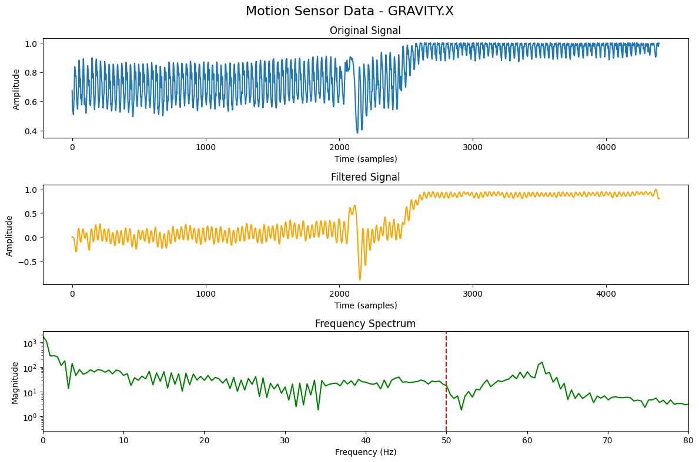

## **Project Title**  
**Automated Signal Processing Pipeline for IoT and Motion Sensor Data**  

---

## **Project Description**  
This project is a Python-based automated signal processing pipeline designed to handle data from IoT and motion sensors. It provides a streamlined workflow for loading, preprocessing, filtering, and analyzing signals, culminating in visualizations of the results. The pipeline can be easily adapted to different datasets and sensor types, making it versatile for environmental and motion-related signal analysis.  

---

## **Key Features**  
- **Modular Design**: Organized in steps for loading, preprocessing, filtering, analyzing, and visualizing signal data.  
- **Compatibility**: Works with environmental sensor data (e.g., CO levels) and motion sensor data (e.g., smartphone attitude pitch).  
- **Frequency Spectrum Analysis**: Provides FFT-based frequency content of the signal with an optional cutoff frequency indication.  
- **Customizable Parameters**: Cutoff frequency, sampling rate, and filter order can be adjusted.  
- **Visualization**: Displays original, filtered signals, and frequency spectrum for insights.  

---

## **Setup and Dependencies**  
Ensure the following libraries are installed:  
```bash  
numpy  
pandas  
matplotlib  
scipy  
```  
You can install these using:  
```bash  
pip install numpy pandas matplotlib scipy  
```  

---

## **How to Use**  

1. Clone this repository and navigate to the project directory.  
2. Replace the dataset path and column name with your dataset details. Example:  
   - **Environmental Data**: `dataset_path = '/kaggle/input/environmental-sensor-data-132k/iot_telemetry_data.csv'`  
     `column_to_process = 'co'`  
   - **Motion Sensor Data**: `dataset_path = '/kaggle/input/motionsense-dataset/A_DeviceMotion_data/A_DeviceMotion_data/dws_1/sub_14.csv'`  
     `column_to_process = 'attitude.pitch'`  
3. Run the pipeline in the notebook or Python script.  
4. Review visualizations and frequency spectrum results generated by the pipeline.  

---

## **Data Sources**  

1. **Environmental Sensor Telemetry Data**  
   - Description: A dataset capturing telemetry from various environmental sensors.  
   - Source: [Environmental Sensor Telemetry Data on Kaggle](https://www.kaggle.com/code/victoriaofuasia/automated-signal-processing)  

2. **MotionSense Dataset**  
   - Description: A smartphone motion dataset containing signals like pitch, roll, and yaw.  
   - Source: [MotionSense Dataset on Kaggle](### README: Automated Signal Processing Pipeline  

---

## **Project Title**  
**Automated Signal Processing Pipeline for IoT and Motion Sensor Data**  

---

## **Project Description**  
This project is a Python-based automated signal processing pipeline designed to handle data from IoT and motion sensors. It provides a streamlined workflow for loading, preprocessing, filtering, and analyzing signals, culminating in visualizations of the results. The pipeline can be easily adapted to different datasets and sensor types, making it versatile for environmental and motion-related signal analysis.  

---

## **Key Features**  
- **Modular Design**: Organized in steps for loading, preprocessing, filtering, analyzing, and visualizing signal data.  
- **Compatibility**: Works with environmental sensor data (e.g., CO levels) and motion sensor data (e.g., smartphone attitude pitch).  
- **Frequency Spectrum Analysis**: Provides FFT-based frequency content of the signal with an optional cutoff frequency indication.  
- **Customizable Parameters**: Cutoff frequency, sampling rate, and filter order can be adjusted.  
- **Visualization**: Displays original, filtered signals, and frequency spectrum for insights.  

---

## **Setup and Dependencies**  
Ensure the following libraries are installed:  
```bash  
numpy  
pandas  
matplotlib  
scipy  
```  
You can install these using:  
```bash  
pip install numpy pandas matplotlib scipy  
```  

---

## **How to Use**  

1. Clone this repository and navigate to the project directory.  
2. Replace the dataset path and column name with your dataset details. Example:  
   - **Environmental Data**: `dataset_path = '/kaggle/input/environmental-sensor-data-132k/iot_telemetry_data.csv'`  
     `column_to_process = 'co'`  
   - **Motion Sensor Data**: `dataset_path = '/kaggle/input/motionsense-dataset/A_DeviceMotion_data/A_DeviceMotion_data/dws_1/sub_14.csv'`  
     `column_to_process = 'attitude.pitch'`  
3. Run the pipeline in the notebook or Python script.  
4. Review visualizations and frequency spectrum results generated by the pipeline.  

---
## Visualization

The pipeline generates visualizations that include:

- The original signal.
- The filtered signal.
- The frequency spectrum.

Here is an example visualization from the analysis:



---

## **Data Sources**  

1. **Environmental Sensor Telemetry Data**  
   - Description: A dataset capturing telemetry from various environmental sensors.  
   - Source: [Environmental Sensor Telemetry Data on Kaggle](https://www.kaggle.com/datasets/garystafford/environmental-sensor-data-132k)  

2. **MotionSense Dataset**  
   - Description: A smartphone motion dataset containing signals like pitch, roll, and yaw.  
   - Source: [MotionSense Dataset on Kaggle](https://www.kaggle.com/datasets/malekzadeh/motionsense-dataset)  

---

## **Author**  
Victoria Ofuasia  

For further details, visit the project on Kaggle:  
[Kaggle Notebook](https://www.kaggle.com/code/victoriaofuasia/automated-signal-processing)  

---

## **Acknowledgments**  
Special thanks to the authors of the datasets and to Kaggle for hosting the datasets and the tools necessary to execute this project.  

---
